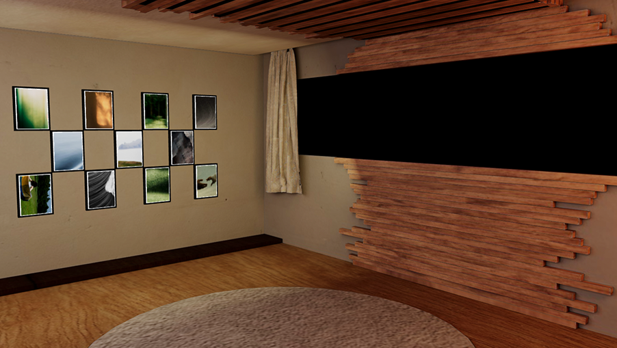
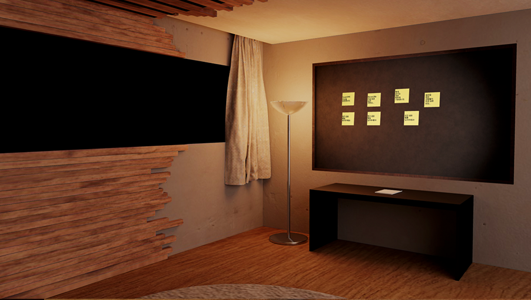

<div align="center">

# RoomOf

### 언제 어디서든, 보고 싶은 사람을 만나는 공간

<br />

 

<br />

한 사람을 추모하기 위한 **가상 공간**을 제공하는 서비스입니다.

언제 어디서든 보고싶은 사람을 만날 수 있는 공간을 제공하고자 하는 마음에 만들게 되었습니다.

<br />

[](https://nextjs.org/)
[](https://react.dev/)
[](https://threejs.org/)
[](https://www.typescriptlang.org/)
[](https://tailwindcss.com/)

</div>

---

## 목차

- [서비스 소개](#서비스-소개)
  - [가상공간 제공](#-가상공간-제공)
  - [TTS](#-tts)
  - [방명록](#-방명록)
- [기술 스택](#기술-스택)
- [시작하기](#시작하기)

---

## 서비스 소개

### 🏠 가상공간 제공

Three.js 로 구현된 가상 공간에 해당 인물의 **사진/동영상**, **인물의 목소리 (TTS)**, **방명록** 등을 제공합니다.

### 🔊 TTS

> ⚠️ 현재 서버의 문제로 작동하지 않습니다.

인물의 목소리를 학습하여, 듣고 싶은 말을 입력하면 해당 인물의 목소리로 글을 읽어줍니다.

### 📝 방명록

해당 인물에게 남기고 싶은 말을 남길 수 있는 방명록입니다. 다른 사람들도 들어와 어떤 사람들이 해당 인물을 그리워하는지 볼 수 있습니다.

---

## 기술 스택

| 분류 | 기술 |
|------|------|
| **Frontend** | Next.js 15, React 19, TypeScript |
| **3D Rendering** | Three.js, React Three Fiber, Drei |
| **Styling** | Tailwind CSS |

---

## 시작하기

```bash
# 의존성 설치
npm install

# 개발 서버 실행
npm run dev
```
